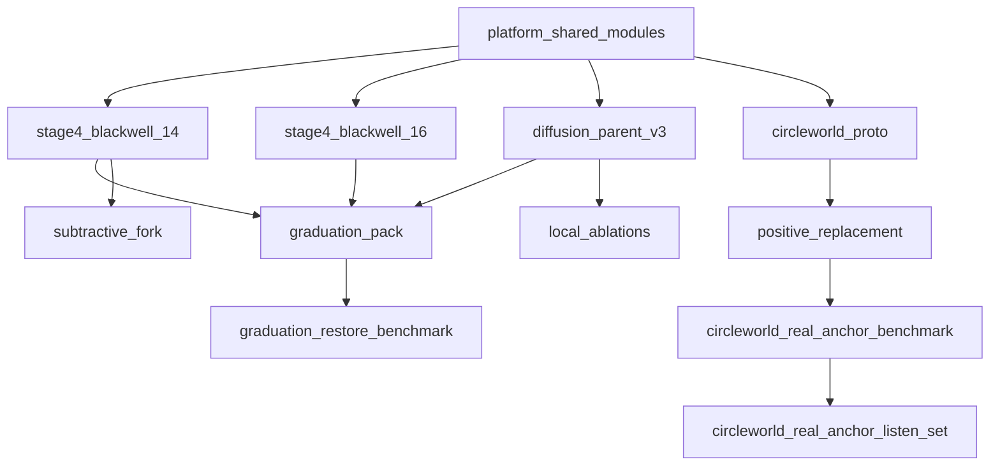
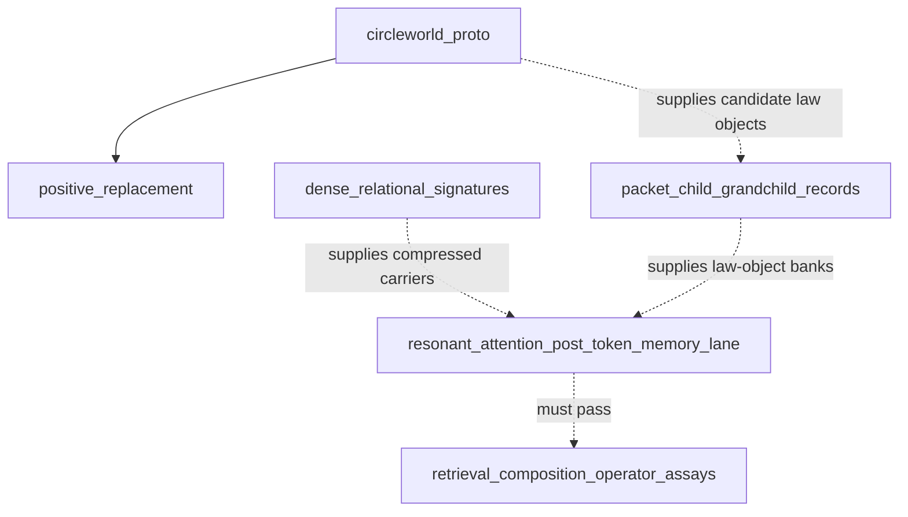
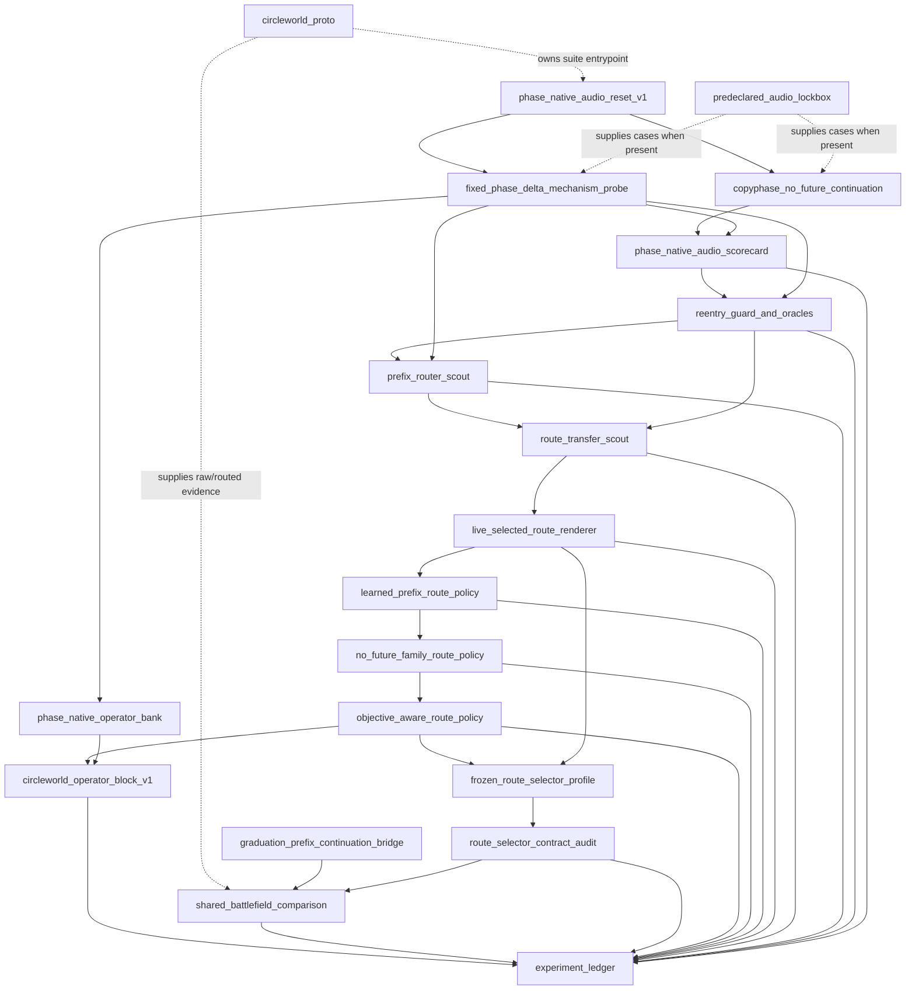

# Inter-Lineage DAG

This is the repo-level dependency map for RAFA. The industry-standard rule we are following is simple:

- branches are workstreams
- runtimes and lineages are architecture
- artifact flow is recorded as a DAG
- branches do not depend on branches

That means we do **not** model "Circleworld depends on the Graduation branch." We model:

- `circleworld_proto` references Graduation-family artifacts
- `positive_replacement` is evaluated by a Circleworld benchmark
- `codex/circleworld` is the active workstream that owns the Circleworld runtime paths
- Resonant Attention / Post-Token Memory is a research lane over Circleworld and
  dense-signature artifacts, not a git branch dependency or a new runtime node
  until the registries say so.

## Policy

- Canonical architecture identifiers live in [D:\RAFA\registries\RUNTIME_REGISTRY.json](D:\RAFA\registries\RUNTIME_REGISTRY.json) and [D:\RAFA\registries\LINEAGE_REGISTRY.json](D:\RAFA\registries\LINEAGE_REGISTRY.json).
- Dependency edges live in [D:\RAFA\registries\PIPELINE_DAG.json](D:\RAFA\registries\PIPELINE_DAG.json).
- Workstream ownership lives in [D:\RAFA\registries\WORKSTREAM_REGISTRY.json](D:\RAFA\registries\WORKSTREAM_REGISTRY.json).
- A branch may own files and directories, but it is not itself an architectural node.

## Current DAG

## Why this is the standard pattern

- It keeps git branches lightweight and temporary.
- It makes it clear which runtime is canonical for each lineage.
- It gives us a machine-readable place to validate dependency flow and catch drift.
- It lets two lanes work in parallel without pretending they are the same architecture.

## Research Lane Overlay

This overlay is documentation-only. It describes active evaluation hierarchy, not
new registry nodes.

Rules for this overlay:

- It does not rename `circleworld_proto`, `positive_replacement`, or any
  existing claim key.
- `relational_qkv_v2` remains a local branch-QKV precursor inside Circleworld.
- Full RAFA attention requires reusable law-object retrieval, cross-depth
  composition, and operator-value causality.
- If the lane becomes a canonical runtime or lineage, the registries must be
  updated in a separate change.

## Phase-Native Audio Testing Overlay

This overlay is also documentation-only. It records the audio-facing reset
suite without adding a new canonical runtime or lineage node.

Rules for this overlay:

- The suite entrypoint is
  [D:\RAFA\runtimes\circleworld_proto\run_phase_native_audio_reset_suite.py](D:\RAFA\runtimes\circleworld_proto\run_phase_native_audio_reset_suite.py).
- It tests phase-native audio usefulness, not childworld ontology.
- It may use Circleworld checkpoints as inputs, but it does not declare or
  promote a checkpoint by itself.
- It must report future-magnitude and future-phase access flags before any
  positive interpretation.
- A promotion candidate must beat copy-last waveform and copyphase carrier
  baselines on correlation while not worsening MSE, loop autocorrelation, or
  first-chunk reentry versus copy-last.
- Reentry oracles are evidence overlays, not runtime selectors. A
  target-normalized oracle pass establishes operator/router capacity only; a
  deployable policy must select routes from prefix-only information and rerun
  on held-out lockbox cases.
- Prefix-router scouts may train or select from no-future Circleworld/prefix
  metadata, but they remain evidence overlays until rerun as live rendering
  policies on fresh lockbox cases.
- `circleworld_operator_block_v1` consolidates the legal route-selector path
  into an internal Circleworld operator block. It is not a Graduation
  comparison and does not promote raw Circleworld by itself.
- Route-transfer scouts apply a source-lockbox route table to a target lockbox.
  They are stronger than same-lockbox oracles but still do not replace a live
  renderer/router that chooses before audio rendering.
- Live selected-route renderers choose the route before rendering and therefore
  are runtime experiments. They are still not promotional until the route policy
  itself is frozen before a fresh lockbox run or learned from legal prefix-only
  features.
- Learned prefix route policies may use source-lockbox oracle labels for
  training, but target route selection must consume only no-future
  Circleworld/prefix metadata. They must beat frozen family-table baselines on
  held-out lockboxes before replacing family-conditioned routing.
- No-future family route policies are a diagnostic bridge between file/family
  labels and operator-family routing. Passing them does not prove semantic
  family recognition; it proves a feature-to-operator-basin route can be useful.
- Objective-aware route policies derive labels from source-lockbox route
  outcomes, not file/family names. They may become promotion candidates only
  after the objective and model are frozen before a fresh lockbox run.
- Frozen route-selector profiles are component artifacts, not full audio-model
  promotions. They must name source lockboxes, target lockboxes, feature keys,
  selected-route evidence, raw-Circleworld guard evidence, and artifact hashes.
- Route-selector contract audits must verify no-future target route selection,
  source/target separation, raw-Circleworld non-promotion, selected-route metric
  guards, and feature-key hygiene before any promotion language.

## Practical rules

### For Circleworld

- Active branch: `codex/circleworld`
- Canonical runtime: [D:\RAFA\runtimes\circleworld_proto](D:\RAFA\runtimes\circleworld_proto)
- Canonical lineage: [D:\RAFA\lineages\04_positive_replacement](D:\RAFA\lineages\04_positive_replacement)
- Graduation outputs are reference inputs, not owned outputs.
- Resonant Attention / Post-Token Memory may consume Circleworld packets,
  childworld records, and `relational_qkv_v2` diagnostics as evidence inputs,
  but it may not claim Circleworld branch-QKV as full RAFA attention.
- Phase-Native Audio Reset may consume Circleworld checkpoints and WAV
  lockboxes as evidence inputs, but it remains a testing-suite overlay until
  the registries are updated in a separate promotion change.

### For Graduation restore

- Active branch: `codex/graduation-runtime`
- Canonical runtime: [D:\RAFA\runtimes\stage4_blackwell_14](D:\RAFA\runtimes\stage4_blackwell_14)
- Canonical lineage: [D:\RAFA\lineages\01_parent_graduation](D:\RAFA\lineages\01_parent_graduation)
- Circleworld paths are reference-only from that branch.

## Validation

The DAG and workstream ownership rules are checked by:

- [D:\RAFA\tests\test_registry_integrity.py](D:\RAFA\tests\test_registry_integrity.py)

That test now verifies:

- registry files exist
- DAG node paths exist
- DAG edges are acyclic and point to known nodes
- workstream branches exist locally
- owned paths resolve in the repo
