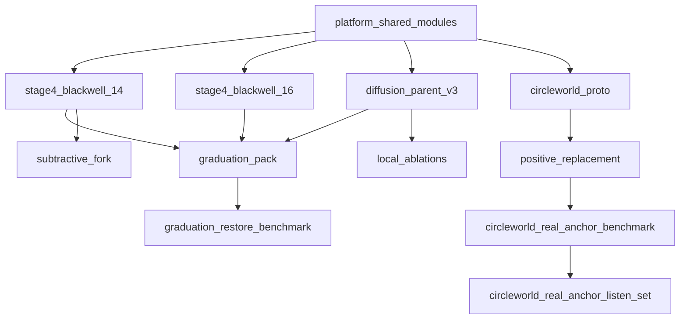

# Inter-Lineage DAG

This is the repo-level dependency map for RAFA. The industry-standard rule we are following is simple:

- branches are workstreams
- runtimes and lineages are architecture
- artifact flow is recorded as a DAG
- branches do not depend on branches

That means we do **not** model "Circleworld depends on the Graduation branch." We model:

- `circleworld_proto` references Graduation-family artifacts
- `positive_replacement` is evaluated by a Circleworld benchmark
- `codex/circleworld` is the active workstream that owns the Circleworld runtime paths

## Policy

- Canonical architecture identifiers live in [D:\RAFA\registries\RUNTIME_REGISTRY.json](D:\RAFA\registries\RUNTIME_REGISTRY.json) and [D:\RAFA\registries\LINEAGE_REGISTRY.json](D:\RAFA\registries\LINEAGE_REGISTRY.json).
- Dependency edges live in [D:\RAFA\registries\PIPELINE_DAG.json](D:\RAFA\registries\PIPELINE_DAG.json).
- Workstream ownership lives in [D:\RAFA\registries\WORKSTREAM_REGISTRY.json](D:\RAFA\registries\WORKSTREAM_REGISTRY.json).
- A branch may own files and directories, but it is not itself an architectural node.

## Current DAG

## Why this is the standard pattern

- It keeps git branches lightweight and temporary.
- It makes it clear which runtime is canonical for each lineage.
- It gives us a machine-readable place to validate dependency flow and catch drift.
- It lets two lanes work in parallel without pretending they are the same architecture.

## Practical rules

### For Circleworld

- Active branch: `codex/circleworld`
- Canonical runtime: [D:\RAFA\runtimes\circleworld_proto](D:\RAFA\runtimes\circleworld_proto)
- Canonical lineage: [D:\RAFA\lineages\04_positive_replacement](D:\RAFA\lineages\04_positive_replacement)
- Graduation outputs are reference inputs, not owned outputs.

### For Graduation restore

- Active branch: `codex/graduation-runtime`
- Canonical runtime: [D:\RAFA\runtimes\stage4_blackwell_14](D:\RAFA\runtimes\stage4_blackwell_14)
- Canonical lineage: [D:\RAFA\lineages\01_parent_graduation](D:\RAFA\lineages\01_parent_graduation)
- Circleworld paths are reference-only from that branch.

## Validation

The DAG and workstream ownership rules are checked by:

- [D:\RAFA\tests\test_registry_integrity.py](D:\RAFA\tests\test_registry_integrity.py)

That test now verifies:

- registry files exist
- DAG node paths exist
- DAG edges are acyclic and point to known nodes
- workstream branches exist locally
- owned paths resolve in the repo
